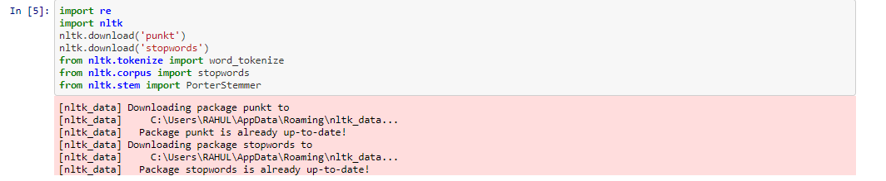
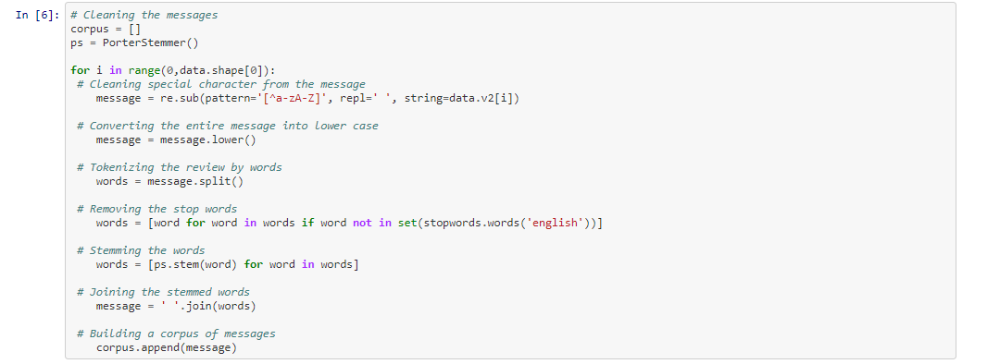
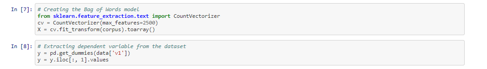
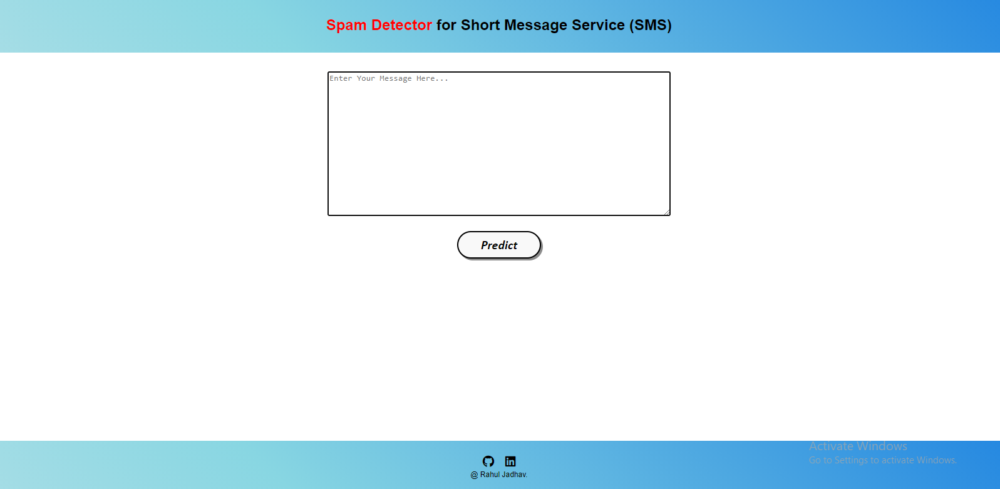
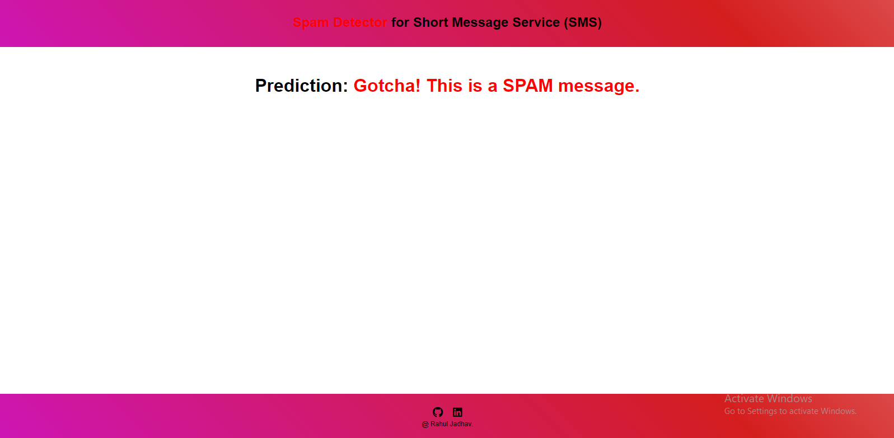

# Spam Detection
# Overview
Hello all, This spam detecter is build using nltk libraries and for deployment flask framework is used., Lets take a look at the code.

<h3>Code Part-1</h3>
Import all necessary libraries from nltk.

<h3>Code Part-2</h3>
Cleaning the messages/data
Here for data cleaning, PorterStammer is used for stemming purpose, data is cleaned by applying regular expression.
<h5>StopWords helps to remove all the stopwords present in sentances.</h5>
<h5>Corpus is our new cleanned sentances data ready to create vectors.</h5>

<h3>Code Part-3</h3>
Creating the Bag of Words model
<h5>Here the corpus is passed to CountVectorizer from sklearn</h5>
<h5>Sentences are created as vectors to understand by the algorithm.</h5>

<h3>Code Part-4</h3>
Model Building & prediction
<h5></h5>

# Screens 

