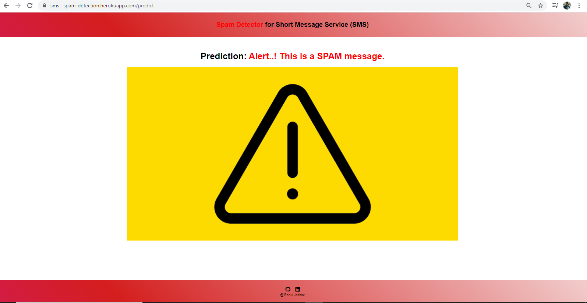

# Spam Detection
# Overview
Hello all, This spam detecter is build using nltk libraries, Lets take a look at the code.
Code Part-1
Import all necessary libraries from nltk.

import re
import nltk
nltk.download('punkt')
nltk.download('stopwords')
from nltk.tokenize import word_tokenize
from nltk.corpus import stopwords
from nltk.stem import PorterStemmer

Code Part-2
Cleaning the messages/data

Code Part-3
Creating the Bag of Words model

Code Part-4
Model Building & prediction

# Screens 

